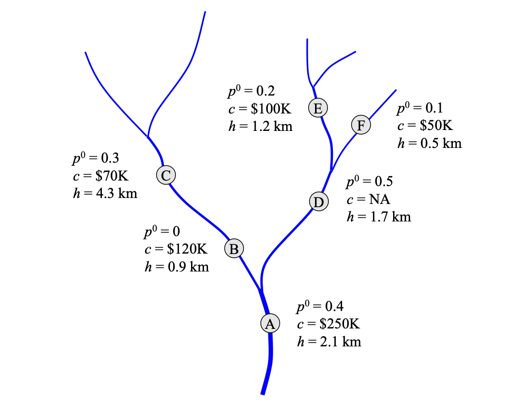

# Data

The three main types of data managed by the server are **barriers**, **targets**, and **passability**.

## Barriers

A barrier can be a tide gate, culvert, or any other impediment to fish migration.

Barrier data is kept in tables that have one row for each barrier.
The columns of the table describe the key attributes:

* a unique **ID**
* a **region** name, which is typically the name of an estuary or river system
* the ID of the barrier immediately downstream; we use the acronym **DSID** (this is left empty if the barrier is the at the mouth of the river)
* the estimated **cost** to repair the barrier
* the barrier's **location**, typically represented by latitude and longitude.

There may be additional data that can be used by a client, for example a barrier type (tide gate, culvert, _etc_) or a descriptive name ("Jones Farm").

## Targets

Stakeholders can have several different goals for a restoration project.
They may want to improve fish passage, or protect farmland or other infrastructure.
Within these general categories are more specific goals.
Different species of fish might find it easier to get past a barrier.
Tide gates set up to protect infrastructure might have different capabilities for farms, roads, or buildings.

Descriptions of targets are also kept in tables, with one row for each target.
The columns of this table describe the attributes of each target:

* the target name, typically the name of fish species ("Coho Salmon") or a type of infrastructure ("Roads & Railroads")
* a unique two-letter identifier, often an abbreviation of the target name ("CO", "RR")
* a shortened name used in output tables ("Coho", "Roads")
* a descriptive name used to label plots; this name should include units ("Potential Habitat (miles)" or "Roads Protected (miles)")

## Passability

When OptiPass is searching for the most effective combination of barriers to replace for a given amount of money it needs to know what the potential gains are for replacing a barrier.
This is where the concept of **passability** is used.

Every barrier has some effect on each target.
The relevant information is

* the **habtitat** immediately upstream from the barrier, up to the next barrier if there is one, or to the end of the river
* the current level of passability (abbreviated as **prepass**), represented by a number between 0 (completely blocked) and 1 (totally passable)
* the potential level of passability if the barrier is repaired or replaced (abbreviated **postpass**), also a number between 0 and 1

For fish targets habitat is the number of river miles above the barrier. This can be different for each species, _e.g._ a river can be a better food source or better spawning grounds for different species.

For infrastructure targets we still use the term "habitat" even though the meaning of this attribute will not be the same.  For buildings the "habitat" value is the number of buildings protected, for farmland it would be the number of acres, and so on.

In order to do calculations that combine different types of targets the tables also include a **scaled habitat** value, where the different types of habitat numbers have been converted to a common scale.
The scaled values are given to OptiPass so it can compare targets of all types.  The original unscaled values are used in plots and output tables.

## Projects

The data managed by the server can be organized into separate projects.
The server comes with a **demo project** that has the example data from the _OptiPass User Manual_.  Users can add their own data for actual river systems in one or more additional projects. For example, a project named **oregon** has descriptions of over 1000 tide gates in 10 river systems on the Oregon coast.

Projects not only include the barrier data but also formatting information used by a client.
This includes geographic coordinates so barriers can be plotted on a map and various descriptions in HTML files that can be displayed by a graphical user interface.

Detailed instructions for how to format barrier files, target descriptions, passability tables, and project descriptions can be found in [Installation and Configuration](install.md).

## Example

The small river system used as an example in the OptiPass user manual has six barriers, named `A` through `F`.  `A` is at the mouth of the river, and the rest are all upstream from `A`:

At each barrier _p⁰_ is the pre-mitigation (prepass) value, _c_ is the cost to repair the barrier, and _h_ is the habitat (in river kilometers) directly upriver from the barrier.  In this example barrier `D` is a natural barrier that cannot be replaced, so there is no cost associated with this node.

In order to show how barriers can be organized into regions and displayed in a GUI we put the barriers on an imaginary map and assigned them to two different rivers.  The barrier file has these columns (plus a few more not shown here):

| ID | region | DSID | cost | X | Y |
| -- | ------ | ---- | ---- | - | - |
| A | Trident  | NA | 250000 | 330 | 202 |
| B | Red Fork | A |  120000 | 235 | 230 |
| C | Red Fork | B |  70000 | 148 | 220 |
| D | Trident  | A |  NA | 195 | 335 |
| E | Trident  | D |  100000 | 100 | 440 |
| F | Trident  | D |  50000 | 125 | 450 |

The figure above shows values for only one target.  Later in the manual there is an example that has a second target.  We put the data for both targets in a passability table:

| ID | HAB1 | PRE1 | POST1 | HAB2 | PRE2 | POST2 |
| -- | ---- | ---- | ----- | ---- | ---- | ----- |
| A | 2.1 | 0.4 | 1.0 | 1.68 | 0.6 | 1.0 |
| B | 0.9 | 0.0 | 1.0 | 0.72 | 0.0 | 1.0 |
| C | 4.3 | 0.3 | 1.0 | 3.44 | 0.45 | 1.0 |
| D | 1.7 | 0.5 | NA | 1.36 | 0.75 | NA |
| E | 1.2 | 0.2 | 1.0 | 0.96 | 0.3 | 1.0 |
| F | 0.5 | 0.1 | 1.0 | 0.40 | 0.15 | 1.0 |

> _Note: the barrier table and passability table have the same rows and row labels, so all this information could go in a single table.  We split them into two tables to make it easier to keep track of passability values._

The two targets in the manual are referred to simply as "T1" and "T2", but we put them in a table to show how longer descriptions are represented:

| abbrev | long | short | label |
| ------ | ---- | ----- | ----- |
| T1 | Target 1 | Targ1 | Target 1 (km) |
| T2 | Target 2 | Targ2 | Target 2 (km) |

The final piece of information the server needs is a table that connects the targets (described in the target table above) with their passability values (names of columns in the passability table):

|  abbrev | habitat | prepass | postpass | unscaled |
|  ------ | ------- | ------- | -------- | -------- |
|  T1 | HAB1 | PRE1 | POST1 | HAB1 |
|  T2 | HAB2 | PRE2 | POST2 | HAB2 |

This tells the server to find data for target `T1` in columns `HAB1`, `PRE1`, and `POST1`, and the data for target `T2` are in `HAB2`, `PRE2`, and `POST2`.

Since the demo project does not have scaled data (habitat for both targets is defined in terms of river miles) the name in the `unscaled` column is the same as the name in the `habitat` column.
For a data set with scaled habitats there would be four columns for each target in the passability table and the column name table would refer to all four names.

