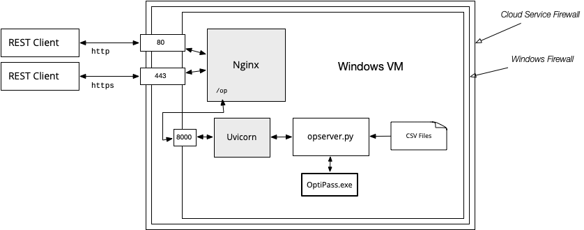

# Installation and Configuration

## Set Up a Windows Server

Since OptiPass is a Windows application it must be run from a Windows system.
The easiest way to set up a new server is to create a Windows VM at Amazon Web Services or any cloud based hosting service.

The OptiPass Server is written entirely in Python.
It uses a library named FastAPI to create a RESTful web service.
When you start the program FastAPI will start up a web server (named Uvicorn) and have it listen for connections, by default using port 8000.

You could then open up that port on your system so the OptiPass Client (or any other application) could connect to your server.
However, the simple web server that comes with FasstAPI is very rudimentary.
Instead, the developers of FastAPI recommend installing an "industrial strength" server like Nginx or Apache and connecting to Uvicorn with a reverse proxy.



One of the advantages of Nginx or Apache is that they can handle encrypted connections using HTTPS.

## Install the Python Modules

Install Python and Pip (the Package Installer for Python).  You can use any version of Python later than 3.11.1.

The easiest way to install the server is to tell Pip to get the code from GitHub.  Start a Powershell window, create a directory where you want to install the code, and then type this command from that directory:

```powershell
> python -m pip install https://github.com/conery/op-server.git
```

As an alternative, clone the repo:

```powershell
> gh repo clone conery/op-server
```

Then `cd` to the new repo and type this command (note the period at the end of the line):

```powershell
> python -m pip install .
```

## Install OptiPass

Make a new folder named `bin` in the repo.
Obtain a copy of `.exe` file for OptiPass from EcoTelligence LLC or another source.
Make sure it's the __command line__ executable, not the GUI version.
It should be named `OptiPassMain.exe`.
Put this file in the `bin` folder.

## Add Data Files to the `static` Directory

The server organizes data according to __projects__.
Each project can have its own barrier data, restoration targets, and so on.

All of this data is located in the `static` folder in the repo.
Inside that folder are six subfolders:
```
./static
├── barriers
├── colnames
├── html
├── images
├── maps
└── targets
```
Inside these folders are further subfolders for the data for each project, where the name of the project matches the name of the subfolder.
For example, if a server has data for two projects, named `demo` and `oregon` the folders would look like this:
```
./static
├── barriers
│   ├── demo
│   └── oregon
├── colnames
│   ├── demo
│   └── oregon
...
```

The files for the demo project are useful starting points for creating your own project data.
To add your own content, create a new folder in each area, based on the name of your project.
Inside that folder add new CSV or HTML files, following the guidelines in this section.

### `barriers` Directory

There should be two CSV files to describe the barriers in a project:

```
barriers/
├── demo
│   ├── barriers.csv
│   └── passability.csv
```

Both of these files should have one line for each barrier:

* `barriers.csv` will have the basic information about each barrier.
* `passability.csv` will have the habitat, prepass, and postpass values for each target for each barrier.

#### `barriers.csv`

The names of the columns in `barriers.csv` should match the names shown in the table below.

| column name | description | note |
| ----------- | ----------- | ------- |
| `ID` | a unique ID, composed of letters and digits | |
| `region` | geographic region name, typically the name of a river | |
| `DSID` | ID of barrier immediately downstream | (1) |
| `name` | more descriptive barrier name (can be left blank) | |
| `cost` | cost to repair or replace the barrier | (2) |
| `X` | horizontal coordinate of the barrier on the project's map | (3) |
| `Y` | vertical coordinate of the barrier on the project's map | (3) |
| `NPROJ` | a 1 or a 0 to indicate whether or not to include the barrier | (4) |
| `comment` | an optional comment | |

1. Put "NA" in the DSID column if a barrier does not have a downstream neighbor.  Otherwise the name in this column must match an ID in another row.
1. The units in the cost column should be number of dollars.
The OptiPass manual uses "thousands of dollars", _e.g._ it would put 100 in the table to mean $100,000, but in this data set use the full amount and write 100000 (without commas).
1. The coordinate values depend on the type of map.  For static maps use pixels, where (0,0) is the lower left.  For tiled maps use latitude and longitude.
1. Put a 0 in the `NPROJ` column if a barrier cannot be repaired and should not be included in the set analyzed by OptiPass. 

#### `passability.csv`

There should be one line in `passability.csv` for each line in `barriers.csv`.
The first column in this file should also be named `ID`, and the names in this column must match the names in `barriers.csv`.

Following the ID column there should be three columns for each target (four if targets use scaled habitat values).
The names of the columns are arbitrary but should be based on target names (the names will be used in other tables and need to be recognizable).

For example, the two targets in the demo project are named T1 and T2, so natural names for the columns are HAB1, PRE1, and POST1 for the habitat, prepass, and postpass values of target T1, and HAB2, PRE2, and POST2 for the values of target T2.

Here are the first few lines of `passability.csv` for the demo project:

| ID | HAB1 | PRE1 | POST1 | HAB2 | PRE2 | POST2 |
| -- | ---- | ---- | ----- | ---- | ---- | ----- |
| A | 2.1 | 0.4 | 1.0 | 1.68 | 0.6 | 1.0 |
| B | 0.9 | 0.0 | 1.0 | 0.72 | 0.0 | 1.0 |
| ... | ... | ... | ... | ... | ... | ... |

If a project has scaled habitat values include a fourth column for each target and give it an appropriate name.
For example, if the demo project had scaled values, the extra columns might be called sHAB1 and sHAB2.

A `passability.csv` file can be made a bit smaller if two or more columns have the same values.
For example, the postpass columns in the demo project (POST1 and POST2) both have 1.0 for in every row, meaning that after repair all the gates are fully functional.

In that case, the table can be simplified by dropping one of the columns and renaming ther other one to POST (without a target number).

The only requirement is that every name that appears in a mapping file (`colnames.csv`, described below) has to appear as a column somewhere in the passability table.

### `colnames` Directory

The structure of this directory depends on whether a project has more than one set of passability values for targets.
This is what the directory looks like on a server that has two projects, one for the demo data and one for the Oregon coast:

```
colnames/
├── demo
│   └── colnames.csv
└── oregon
    └── climate
        ├── current.csv
        └── future.csv
```

The fact that there is only one file in the `demo` folder means there is only one way to associate target names with passability values, and it's in the file named `colnames.csv`.

The subdirectory under `oregon` means users will have a choice, named "climate" (using the name of the subdirectory), and can pick which set of passability values to use.

Regardless of how the directory is structured, all the CSV files have the same information.
There will be one row for each target, and the contents will be names of columns from the `passability.csv` file for the project.

Here is the file for the demo project:

| abbrev | habitat | prepass | postpass | unscaled |
| --- | --- | --- | --- | --- |
| T1 | HAB1 | PRE1 | POST1 | HAB1 |
| T2 | HAB2 | PRE2 | POST2 | HAB2 |

The first row says the passability values for target T1 can be found in columns named HAB1, PRE1, and POST1 in the project's `passability.csv` file. 

If a project uses scaled habitat values, put the name of the scaled habitat in the `habitat` column and the name of the original unscaled values in the `unscaled` column.

The demo project does not have scaled habitats, so the name in the `unscaled` column is just the same as the name in the `habitat` column.

### `html` Directory

The `html` directory has static content the client will display in a GUI.

```
html
├── demo
│   ├── help.html
│   └── welcome.html
```

The Welcome tab in the GUI describes a project and gives the overall description of the workflow required to use OptiPass.

A Help tab has detailed instructions of how to use each "widget" to enter optimization parameters.

Each project can tailor the contents of these files to fit their data.

### `maps` Directory

The `maps` directory tells a client how to draw the map for the project.  This is the `maps` directory for the demo project:

```
maps
├── demo
│   ├── Riverlands.png
│   └── mapinfo.json
```

Every project needs a `mapinfo.json` file.
This is the file for the demo project:

```
{
    "map_type": "StaticMap",
    "map_file": "Riverlands.png",
    "map_title": "The Riverlands",
    "map_tools": ["hover"]
}
```

The `map_type` entry can be either StaticMap or TiledMap.

* A StaticMap is simply a PNG image.  If a project has a StaticMap there must also be a `map_file` entry in the JSON file and a PNG file of that name should also be placed in the `maps` directory.
* If the map type is TiledMap the client will connect to a tile server to draw the map.  Map coordinates are taken from the barrier file, and the map that appears in the GUI will be big enough to include all barriers.

The `map_title` and `map_tools` entries are used by the client.
The tools are icons drawn at the bottom of the map that allow the user to interact with the map, _e.g._ to zoom in or move around.
The items that can appear in the `map_tools` list are:

* `hover`, which will display the ID and other information about a barrier when the user moves their mouse over a barrier on the map
* `wheel_zoom` allows the user to zoom in or out
* `pan` allows the user to move the map left/right or up/down
* `reset` is a button that restors a map to the original coordinates after panning or zooming


### `targets` Directory

The `targets` directory for a project needs two files:

```
targets
├── demo
│   ├── layout.txt
│   └── targets.csv
```

The CSV file has entries that describe the restoration targets for the project.
The file should have the following columns:

| column name | description |
| ----------- | ----------- |
| `abbrev` | a unique two-letter ID for the target  |
| `long`   | the full name of the target |
| `short` | a shorter name used in output tables |
| `label` | a name to use in plots, which should include units |
| `infra` | True if the target has multiple colname mappings |

Here are two examples from the Oregon Coast project (which has more interesting targets than the demo data):

| abbrev | long | short | label | infra |
| --- | --- | --- | --- | --- |
| CO | Coho Streams | Coho | Habitat Potential (miles) | False |
| AG | Agriculture | Agric | Farmland Potentially Protected (acres) | True |

The layout file is used by the client to display the GUI elements that let users select targets.
As an example, the Oregon project has ten targets, six for fish species and four for infrastructure.
If we want the GUI to arrange them in two columns, with fish targets (which have names CO, CH, ST, ...) in the left column and infrastructure targets (named AG, RR, BL, ...) on the right, the layout file simply lists the names in the order they should be displayed:

```
CO AG
CH RR
ST BL
...
```
